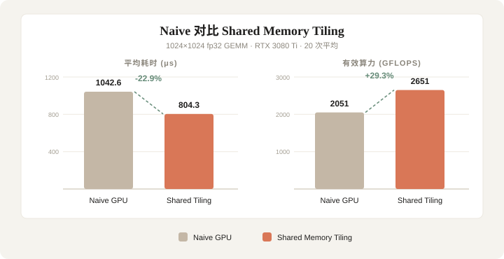

# GPU GEMM nsys 性能分析报告

> 分析日期：2026-07-29  
> 工具：NVIDIA Nsight Systems 2026.3.1  
> 硬件：NVIDIA GeForce RTX 3080 Ti  
> 矩阵规模：1024×1024 单精度浮点

---

## 1. 耗时占比总览


| 类别 | 总耗时 | 占比 |
|------|--------|------|
| **Kernel（计算）** | 36.94 ms | **93.0%** |
| **Memcpy（数据传输）** | 2.79 ms | **7.0%** |

---

## 2. GPU Timeline


根据 nsys trace 数据重建的执行时间轴（两个 GEMM 版本各自独立计时）：

- **Naive GPU**：H2D（2 个矩阵）→ `add` kernel × 20 → D2H，全程约 **23.0 ms**
- **Shared Memory Tiling**：H2D → `shared_gemm` kernel × 20 → D2H，全程约 **18.2 ms**
- 时间轴绝大部分被 Kernel 占据，Memcpy 仅出现在首尾，直观印证 **93% / 7%** 的耗时占比

---

## 3. 详细耗时分解

### 3.1 Kernel 耗时

| Kernel | 总耗时 (ns) | 次数 | 平均耗时 (ns) | 占比 |
|--------|-------------|------|---------------|------|
| `add` (Naive GPU) | 20,852,258 | 20 | 1,042,613 | 56.5% |
| `shared_gemm` (Shared Memory Tiling) | 16,085,424 | 20 | 804,271 | 43.5% |
| **Kernel 总计** | **36,937,682** | | | **100%** |

### 3.2 Memcpy 耗时

| 操作 | 总耗时 (ns) | 次数 | 平均耗时 (ns) |
|------|-------------|------|---------------|
| H2D (Host → Device) | 1,520,893 | 2 | 760,447 |
| D2H (Device → Host) | 1,273,471 | 2 | 636,736 |
| **Memcpy 总计** | **2,794,364** | | |

---

## 4. 关键发现

### 4.1 计算占主导

- Kernel 计算占总耗时的 **93%**，数据传输仅占 **7%**
- 说明当前瓶颈在计算而非内存传输

### 4.2 Shared Memory 优化效果



| 版本 | 平均耗时 (ns) | 有效算力 | 相对提升 |
|------|---------------|----------|----------|
| Naive GPU | 1,042,613 | ~2051 GFLOPS | - |
| Shared Memory Tiling | 804,271 | ~2651 GFLOPS | **22.9%** |

Shared Memory Tiling 比 Naive GPU 快约 **1.3 倍**，与理论预期一致。

### 4.3 数据传输分析

- 每次 H2D 传输 ~4MB（1024×1024×4 bytes × 2 个矩阵）
- 每次 D2H 传输 ~4MB（结果矩阵）
- 总传输量：~16MB
- 有效带宽：~5.7 GB/s（受限于 PCIe 和 profiling 开销）

---

## 5. 原始数据

nsys profile 原始文件：`nsys-rep/gpu_gemm_profile.nsys-rep`

可使用以下命令查看详细 trace：

```bash
nsys stats --force-export=true nsys-rep/gpu_gemm_profile.nsys-rep --report cuda_gpu_trace
nsys stats --force-export=true nsys-rep/gpu_gemm_profile.nsys-rep --report cuda_gpu_kern_sum
```

---

## 6. 结论

1. **GPU 计算效率远高于 CPU**：GPU Naive 版本 (~2051 GFLOPS) 比最快 CPU 版本 (~99 GFLOPS) 快约 **20 倍**
2. **Shared Memory 优化有效**：提升约 23%，达到 ~2651 GFLOPS
3. **数据传输开销可控**：仅占总耗时 7%，不是主要瓶颈
4. **进一步优化方向**：
   - 使用 Tensor Core（wmma API）
   - 融合多个 Kernel 减少 launch 开销
   - 使用 CUDA Graph 减少 CPU-GPU 同步
